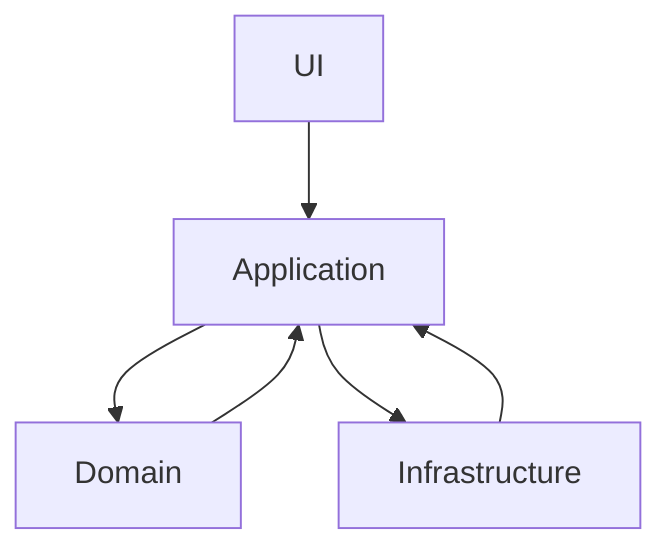

# 📝 Text Comparison Project with Hexagonal Architecture

This project allows you to visualize and export text differences using a hexagonal architecture. It focuses on word-by-word text comparison, highlighting changes and providing the ability to export them in different formats.

---

## 📚 **Technologies Used**

The project was developed using the following technologies:

- **TypeScript:** Static typing for more robust and maintainable code.
- **Vite:** For development environment configuration and execution.
- **Quill.js:** For managing rich text editors.
- **Ionic Framework:** For the user interface with reusable components.
- **diff.js:** For text comparison and difference detection.
- **RxJS:** For managing reactivity and communication between components.

---

## 🏗️ **Hexagonal Architecture**

Hexagonal architecture allows organizing the code into independent layers:

- **Domain:** Pure business logic and entities.  
- **Application:** Use cases and services that handle application flow logic.  
- **Infrastructure:** Adapters that interact with the DOM, databases, or external APIs.  
- **UI (User Interface):** Visual components and pages.  

This approach facilitates testability, maintainability, and project scalability.

---

## 📂 **Folder Structure**

The project is organized as follows:

```
├── src
│   ├── domain         # Pure logic and data transformers
│   ├── application    # Services and use cases
│   ├── infrastructure # DOM and external API adapters
│   └── ui             # User interface components and pages
└── README.md          # Project documentation
```

---

## 🖼️ **Architecture Diagram**



---

## 🏷️ **Key Architecture Decisions**

1. **Hexagonal Architecture:** It decouples business logic from the user interface and infrastructure.  
2. **Use of RxJS:** Instead of directly manipulating the DOM, RxJS was chosen to handle reactivity. This allows components to automatically update when data changes.  

---

## 🚀 **Installation and Execution**

1. Clone the repository:

```bash
git clone https://github.com/mattseidel/WordDiff-Pro.git
cd text-comparison-project
```

2. Install dependencies:

```bash
npm install
```

3. Run the project in development mode:

```bash
npm run dev
```

The project uses **Vite**, so the application will run at `http://localhost:3000` (or the configured port).

---

## 🔮 **Future Improvements (TODO)**

Some ideas for future development include:

1. Greater interactivity in the interface to accept or reject individual changes.  
2. Additional validations to ensure the integrity of comparisons.  
3. Inclusion of unit and integration tests to ensure code quality.  

---

## 🙌 **Credits and References**

This project was inspired by best practices in hexagonal architecture and is supported by the documentation of the following technologies:

- [TypeScript](https://www.typescriptlang.org/)
- [Quill.js](https://quilljs.com/)
- [Ionic Framework](https://ionicframework.com/)
- [RxJS](https://rxjs.dev/)
- [diff.js](https://github.com/kpdecker/jsdiff)
- [Vite](https://vitejs.dev/)

---

© 2024 - Text Comparison Project. All rights reserved.
